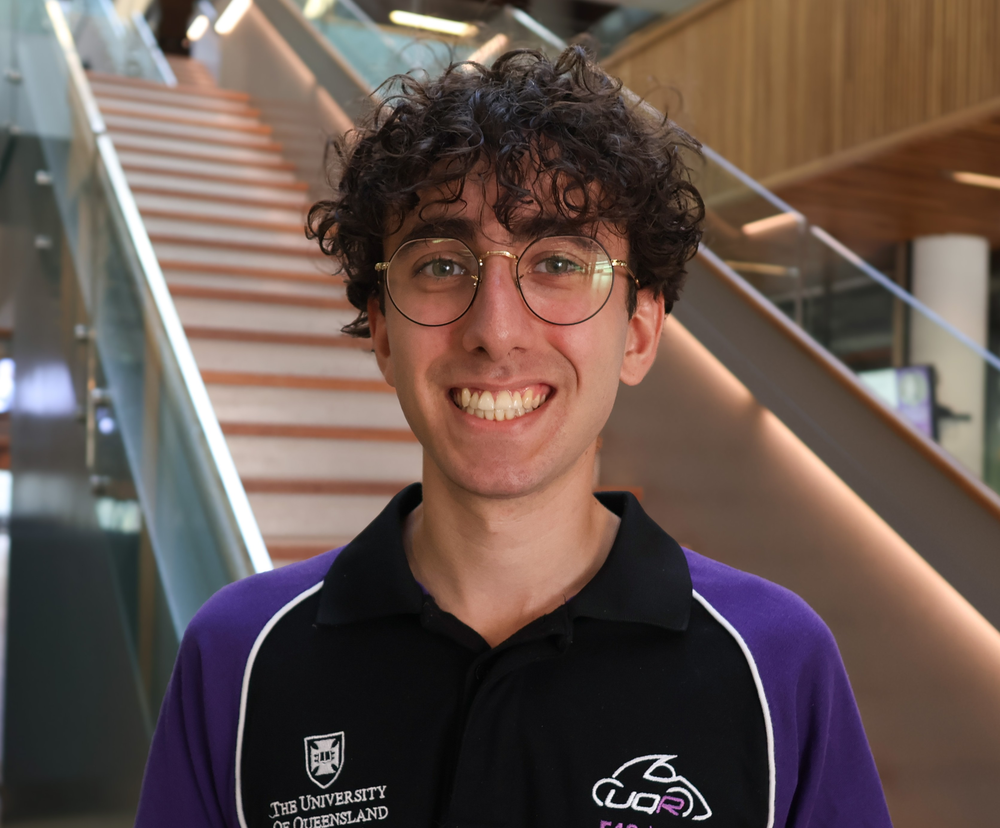

# Tropical TyGoon Submission
The IMC trading competition presented a significant challenge on a simulated exchange, focused on developing effective Python trading strategies (with a cash prize). For this, we assembled a team by drawing talent from the top students of our respective cohorts, ensuring we possessed the specific capabilities required to perform. Our collective effort led to us emerging as the highest ranked team from UQ and achieving a position within the top 0.6% of all competitors.
## The Avengers
<table>
  <tbody>
    <tr>
      <td align="center" valign="top" width="16.28%">
        <a href="https://github.com/TheNoZer0" title="Visit GitHub Profile">
          
           
          <b>Zain Al Saffi</b>
        </a>
         
        
          <a href="https://www.linkedin.com/in/zain-al-saffi-881492250/" title="LinkedIn Profile">🔗 LinkedIn</a>
        
      </td>
      <td align="center" valign="top" width="16.28%">
        <a href="https://github.com/ZacKienzle2" title="Visit GitHub Profile">
          
           
          <b>Zac Kienzle</b>
        </a>
         
        
          <a href="https://www.linkedin.com/in/zac-kienzle-aba665263/" title="LinkedIn Profile">🔗 LinkedIn</a>
        
      </td>
      <td align="center" valign="top" width="16.28%">
        <a href="https://github.com/mashamegul" title="Visit GitHub Profile">
          
           
          <b>Masham Siddiqui</b>
        </a>
         
        
          <a href="https://www.linkedin.com/in/mashamegul/" title="LinkedIn Profile">🔗 LinkedIn</a>
        
      </td>
      <td align="center" valign="top" width="16.28%">
        <a href="https://github.com/roger-y-zhu" title="Visit GitHub Profile">
          
           
          <b>Roger Zhu</b>
        </a>
         
        
          <a href="https://www.linkedin.com/in/roger-zhu-b279512b5/" title="LinkedIn Profile">🔗 LinkedIn</a>
        
      </td>
      <td align="center" valign="top" width="16.28%">
        <a href="https://github.com/AbhinavPradeep" title="Visit GitHub Profile">
          
           
          <b>Abhinav Pradeep</b>
        </a>
         
        
          <a href="https://www.linkedin.com/in/abhinav-pradeep/" title="LinkedIn Profile">🔗 LinkedIn</a>
        
      </td>
      </tr>
  </tbody>
</table>

### Results
| Round | Overall Position | Manual      | Algorithmic | Country |
|-------|------------------|-------------|-------------|---------|
| 1     | 268              | Tied 1st    | 300         | 10th    |
| 2     | 467              | 966         | 516         | 23rd    |
| 3     | 67               | 732         | 61          | 4th     |
| 4     | 54               | 90          | 69          | 4th     |
| 5     | 89               | 626         | 60          | 9th     |

#### Round 1

3 assets were introduced, `SQUID_INK`, `RAINFOREST_RESIN`, and `KELP`. These assets each exhibited different behaviours in the simulation. We found Rainforest to be highly stationary and hovered around a mean of 10,000. We implemented a market-make and market-take strategy around this mean based on a GLFT, we also tested an Ornstein-Uhlenbeck process to model the price of Rainforest. We found that the GLFT was more effective in capturing the mean reversion of the asset. SQUID INK was highly volatile and we did not quit figure it out this round, however later on we discovered that if you find the mean reverting spread within squink and run an EMA on it, you can generate stable signals on the EMA due to the large spikes in the price. Kelp was a bit more difficult to model, we found that it was highly correlated with Rainforest and SQUID INK, however it was not stationary. We used a market-making strategy on Kelp and it worked well. Zac and Abhinav traded the manual strategy, in which you can solve the matrix problem and find the optimal conversions. Hence this resulted in our tied 1st place with 900 other people as there was a clear cut solution to the manual strategy.

#### Round 2

#### Round 3

#### Round 4

#### Round 5
