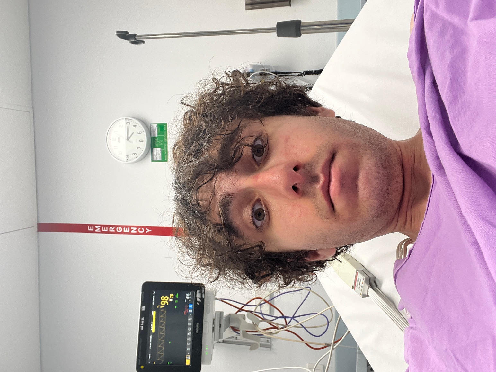

# TROPICAL TYGOON Submission
The IMC trading competition presented a significant challenge on a simulated exchange, focused on developing effective Python trading strategies (with a cash prize). For this, we assembled a team by drawing talent from the top students of our respective cohorts, ensuring we possessed the specific capabilities required to perform. Our collective effort led to us emerging as the highest ranked team from UQ and achieving a position within the top 0.4% of all competitors. Algorithms can be found in algos folder, where new2.py is the latest. Analysis notebooks and visualiser can be found in the analysis folder.
## The Avengers
<table>
  <tbody>
    <tr>
      <td align="center" valign="top" width="16.28%">
        <a href="https://github.com/TheNoZer0" title="Visit GitHub Profile">
          
           
          <b>Zain Al Saffi</b>
        </a>
         
        
          <a href="https://www.linkedin.com/in/zain-al-saffi-881492250/" title="LinkedIn Profile">🔗 LinkedIn</a>
        
      </td>
      <td align="center" valign="top" width="16.28%">
        <a href="https://github.com/ZacKienzle2" title="Visit GitHub Profile">
          
           
          <b>Zac Kienzle</b>
        </a>
         
        
          <a href="https://www.linkedin.com/in/zac-kienzle-aba665263/" title="LinkedIn Profile">🔗 LinkedIn</a>
        
      </td>
      <td align="center" valign="top" width="16.28%">
        <a href="https://github.com/mashamegul" title="Visit GitHub Profile">
          
           
          <b>Masham Siddiqui</b>
        </a>
         
        
          <a href="https://www.linkedin.com/in/mashamegul/" title="LinkedIn Profile">🔗 LinkedIn</a>
        
      </td>
      <td align="center" valign="top" width="16.28%">
        <a href="https://github.com/roger-y-zhu" title="Visit GitHub Profile">
          
           
          <b>Roger Zhu</b>
        </a>
         
        
          <a href="https://www.linkedin.com/in/roger-zhu-b279512b5/" title="LinkedIn Profile">🔗 LinkedIn</a>
        
      </td>
      <td align="center" valign="top" width="16.28%">
        <a href="https://github.com/AbhinavPradeep" title="Visit GitHub Profile">
          
           
          <b>Abhinav Pradeep</b>
        </a>
         
        
          <a href="https://www.linkedin.com/in/abhinav-pradeep/" title="LinkedIn Profile">🔗 LinkedIn</a>
        
      </td>
      </tr>
  </tbody>
</table>

### Results
| Round | Overall Position | Manual      | Algorithmic | Country |
|-------|------------------|-------------|-------------|---------|
| 1     | 268              | Tied 1st    | 300         | 10th    |
| 2     | 467              | 966         | 516         | 23rd    |
| 3     | 67               | 732         | 61          | 4th     |
| 4     | 54               | 90          | 69          | 4th     |
| 5     | 89               | 626         | 60          | 9th     |

### Round 1

Three assets were introduced: SQUID_INK, RAINFOREST_RESIN, and KELP.
Each exhibited different behaviours in the simulation.

  - Rainforest Resin was highly stationary and hovered around a mean of 10,000.
    We implemented a market-make and market-take strategy based on a GLFT (Guéant–Lehalle–Fernandez-Tapia) model.
    We also tested an Ornstein-Uhlenbeck process to model the price dynamics but found GLFT was more effective for capturing mean reversion.

  - Squid Ink was highly volatile, and we did not fully figure it out in Round 1.
    However, later analysis revealed that by finding the mean-reverting spread within Squid Ink and running an EMA (Exponential Moving Average) on it, stable trading signals could be generated due to the large price spikes.

  - Kelp was harder to model.
    It showed strong correlation with Rainforest and Squid Ink, but it was not stationary.
    We used a pure market-making strategy on Kelp, which performed reasonably well.

In the manual strategy, Zac and Abhinav solved the matrix problem to find the optimal conversions.
Since there was a clear-cut solution to the manual part, this resulted in a tied 1st place finish among roughly 900 other competitors.

### Round 2
This round introduced `PICNIC_BASKET1` and `PICNIC_BASKET2`.  
- **Picnic Basket 1** was composed of 6 `CROISSANTS`, 3 `JAMS`, and 1 `DJEMBE`.
- **Picnic Basket 2** consisted of 4 `CROISSANTS` and 2 `JAMS`.

Our **initial strategy** was to assume **basket arbitrage**:  
if the calculated synthetic price of the basket (based on components) was greater than the market price, we would buy the basket and sell the components.

However, analysis showed that when plotting the synthetic basket versus the market price, **there was very little crossover** between the two.  
This meant arbitrage signals would rarely trigger, leading to us getting stuck in unfavourable positions.

Thus, our Round 2 submission shifted to a **regime-switching strategy**:
- Primarily market-making,
- Only switching to basket trading when clear arbitrage appeared.

Unfortunately, this approach netted us **less profit**, contributing to a drop in placement.  
Manual trades also suffered due to miscalculations, choosing two containers was not as profitable as just one because of the crowding effect. The noisy participants gravitated towards the top 2 containers, and those that chose the second best option made a lot of money. We learnt this for round 4.

Later, after Zain spoke to his friend James (an incoming graduate trader at IMC), we learned that **basket trading** was not the correct framework.  
Because you could not "create and redeem" baskets like ETFs, it **was not true basket arbitrage** — it was actually **pairs trading**.

James recommended reviewing KidQuant’s Jupyter notebook, which explained how to **regress the basket vs components**, remove noise, and uncover a mean-reverting spread.

Although we almost implemented this correctly in later rounds, bugs in the code prevented full deployment.  
As a fallback, we ended up using:
- EMA signals for `CROISSANTS`,
- One-sided pairs trading for `DJEMBES` and `CROISSANTS`,
- Discontinuing trading `JAMS` (due to poor performance),
- Pure market making and hedging on baskets.

### Round 3
Round 3 saw the introduction of `VOLCANIC_ROCK` and its vouchers at five different strike prices.  
This resembled a classic options pricing environment.

After seeing our placement drop in Round 2, we decided to lock in harder. During Round 3, Zain pushed himself so hard that he was hospitalised late at night with an irregular heart rhythm and chest pains.  
Even while being admitted, he brought his laptop to the hospital and kept working on the competition. While waiting for tests and treatment, he was reading options theory books to sharpen his understanding and improve our strategies.

Doctors warned him that continuing would risk serious long-term health issues.  

However he made the decision that losing the competition would hurt more than anything his body was going through despite persuation from his parents and peers to stop. Quitting was not considered.  Even when symptoms worsened and he passed out multiple times, he kept contributing to the team's work. He accepted the consequences because, at that moment, winning mattered more than anything else.

  (Zain being a doofus)
  
  

---

Our **initial approach** was to use the **Black-Scholes model** and **delta hedge** the options. Since the options could not be exercised and they were not going to expire before the end of the competition (which was very weird from IMC).
However, we found a major issue:  
if you held a strong position in the options and tried to hedge by trading the underlying asset (`VOLCANIC_ROCK`), it would **move the underlying price**, causing significant losses.

We lost a lot of money initially on volcanic rock hedging.  
Thus, we pivoted strategies:
- Instead of strict delta hedging, we calculated the **mean implied volatility** of the vouchers.
- We then traded based on the **Z-score of implied volatility** and the **volatility smile**.

We also **deactivated direct trading** on volcanic rock to avoid further losses, though Zain later implemented a new strategy for it in Round 5.

The backtester was starting to slip as well and it was hard to tell if we were overfitting or making profit. Zain developed a visualiser that can take IMC data and run analysis on it to identify which assets were underperforming on the actual IMC sim. 

Meanwhile, Roger, Zac, and Masham gridsearched the parameters for the voucher trading algorithm.  
This collective effort **netted us a very strong profit**, bringing us back to **4th in Australia** and **69th overall**.

### Round 4

In Round 4, a new luxury product, `MAGNIFICENT_MACARONS`, was introduced.  
The organisers hinted that its value would be influenced by external observable factors like:

- Sunlight hours
- Sugar prices
- Transport costs
- In- and export tariffs
- Storage constraints

At the same time, the rules specified that holding macarons too long would be risky due to a forced conversion event at a low terminal price.  
The market was designed for decay — macarons would lose value over time, and any unhedged long positions would be punished.

Initially, we built a dynamic market-making and adaptive trading strategy for macarons, which attempted to:

- Estimate pristine buy and sell values based on the observable factors,
- Place adaptive limit orders around implied values, adjusting spreads based on market volatility,
- Implement aggressive "taking" logic when market prices significantly misaligned with fair value,
- Automatically request conversions when needed to manage risk near expiry.

In hindsight, we should have stripped the strategy down entirely.  
The forced conversion made the payoff profile asymmetric — it gave a false sense of security when in reality, the correct trade was to buy from pristine when the markets were favourable or overpriced in the local archipalego.

Because of extreme time pressure this round, Zain’s health condition deteriorating further, and Masham suffering an eye infection that made it difficult to see, we were unable to fully pivot the strategy in time.  
However, due to the strength of our other asset strategies, we still maintained **4th place in Australia** and climbed to **54th overall**.

Manual trading was another major factor:  
Zac and Abhinav applied a Nash Equilibrium proof approach to game the optimal selections, intentionally picking second-best options to avoid overcrowded trades.  
This netted us significant profits in the manual round and helped stabilise our standing.

#### Round 5
No new assets were introduced in Round 5.  
The focus shifted to refining existing strategies and adapting to the newly added feature:  

The ability to see the bots we were trading against and use their behaviour as signals.

Our first priority was fixing the volcanic voucher strategies.  
Despite rigorous checks by Abhinav and Zac, the updated voucher algorithms were still not consistently profitable. After countless rounds of trial and error, we reverted back to Zain’s earlier strategy, tuning the parameters based on fresh testing.

During this process, Zain discovered something almost by accident:  

If you simply ran an EMA (Exponential Moving Average) on `VOLCANIC_ROCK`, it could generate massive profits.  
This realisation was game-changing, it propelled our backtested profits from **$150k to over $1 million**.  
It became one of the core drivers of our performance in the final round. Roger's and Masham were tackling `MAGNIFICENT_MACARONS` however we were not able to figure out exactly how the conversions worked, and shifted to fine tuning all the other strategies. Roger's gridsearch was the best invention to come out of the competition, as it saved us a lot of time and effort. If there was an MVP it would be the gridsearcher.

On the bot analysis side, We identified that **Olivia**, one of the bots, had a strong buy and sell signal pattern, particularly around `CROISSANTS` and `SQUID_INK`.  

In backtesting, following her trades netted positive returns. However, during the live round, Olivia barely traded, rendering the strategy ineffective. The other bots proved too noisy and inconsistent to extract reliable signals within the available time.

Despite improving our algorithmic strategies, we suffered a setback in manual trading.  
We miscalculated some of the RED FLAGS cases, costing us significant money. Our final algorithm iS in `new2.py`

In the end, we finished:
- **9th in Australia overall**
- **60th Algorithmically Worldwide**
- **89th Overall**
- **1st at UQ and in all of Queensland**

It wasn’t a perfect round, but we pushed through, adapted under pressure, and finished at the top of our university and state. 
